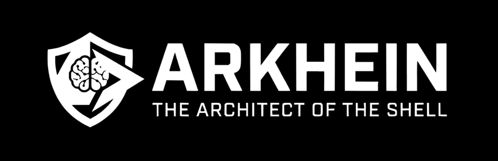
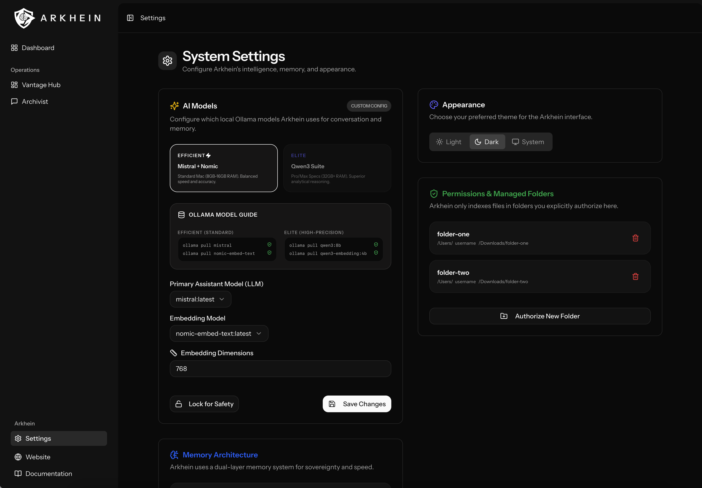

# Arkhein: The Architect of the Shell

Status: Sovereign Architecture Active (Alpha)

Most "agents" are just thin wrappers for cloud-based surveillance. They rent your intelligence and sell your data. Arkhein is different. It is a local-first macOS agent that lives entirely on your silicon. No telemetry. No cloud gatekeepers. No data ever crosses the hardware boundary.

Deep complexity hidden behind a minimalist shell. Command your machine. Own your knowledge.

---

[](https://arkhein.melasistema.com/)

**Note:** This repository is for development and architectural audit. Operators looking for the production build can download the macOS `.dmg` from the official channels.

- **Website:** [arkhein.melasistema.com](https://arkhein.melasistema.com/)
- **Documentation:** [docs.arkhein.melasistema.com](https://docs.arkhein.melasistema.com/)



## The Architecture of Sovereignty

### The Vantage Hub (Verticalized Intelligence)
Arkhein organizes knowledge into Sovereign Silos. Every authorized folder is a unique physical partition with its own semantic grounding.
- Silo Hierarchy: The **Sovereign Tree** architecture (Canopy -> Vessel -> Fragment) for hierarchical, top-down retrieval.
- Level 0 Grounding: Automatic environment scanning detects naming patterns and silo purpose for high-fidelity awareness.
- Isolated Retrieval: 100% topical isolation. Project A will never contaminate Project B.

### The Mind (8-Level Cognitive Pipeline)
Arkhein moves complexity out of model weights and into the process. Using a multi-pass pipeline, it enables small local models (Mistral/Qwen) to match the logic of trillion-parameter giants.
- The Cognitive Pipeline: Grounding -> Perception -> Context -> Canopy -> Decomposition -> Scratchpad -> Critique -> Generation.
- Latent Reasoning: Hidden on-disk scratchpads in an internal laboratory allow for complex math and long-form analysis without truncation.
- Analytical Execution: Direct database-backed structural queries (The Sovereign Coordinator) for 100% accurate file counting and inventory.

### The Memory (Self-Healing SSOT)
SQLite is the ultimate Single Source of Truth. Vektor is the disposable binary accelerator.
- Anchored Persistence: Enriched cognitive context (Vector Anchors) is saved permanently in SQLite for robust, context-aware re-indexing.
- Autonomous Integrity: Lightweight disk signatures and zero-downtime shadow rebuilds ensure the index stays in sync with the filesystem.
- Fail-Safe Performance: Deterministic LLM caching and re-entrant locking ensure the application remains fast and responsive during heavy background tasks.

### The Hand (The Magic Touch)
Arkhein commands the filesystem with surgical precision, secured by the Silo Guard protocol.
- Strategic Commands: /create, /move, /organize, /delete.
- Agentic Assembly: Multi-stage drafting for large-scale summary files, harvesting facts from dozens of documents asynchronously.
- Silo Guard: Mathematically absolute sandbox boundaries prevent path traversal and ensure all operations remain within authorized silos.
- Human-in-the-Loop: Every action requires a verified Strategic Plan. You remain the final authority.

## Operation Protocol

1. Prerequisites: macOS (Silicon preferred), Ollama, PHP 8.4, Node 22.
2. Initialize Infrastructure:
   ```bash
   composer install && npm install
   php artisan native:migrate:fresh
   php artisan native:serve
   ```
3. Prepare the Intelligence (Efficient Profile):
   ```bash
   ollama pull mistral:latest
   ollama pull qwen3-vl:latest
   ollama pull nomic-embed-text:latest
   ```
4. Configure: Launch Arkhein. The system will auto-detect your models and guide you through the "Lead-by-the-Hand" verification. Authorize your silos and monitor the Earthbeat.

## The Sovereign Archivist
A centralized module for global RAG and system intelligence. Leverages the **Canopy Discovery Layer** for surgical hierarchical search across all authorized silos. Use it to search across your digital fortress or to analyze the architecture itself.

---
Arkhein: Command your Silicon. Own your Memory.  
MIT License (c) 2026 Luca Visciola.
